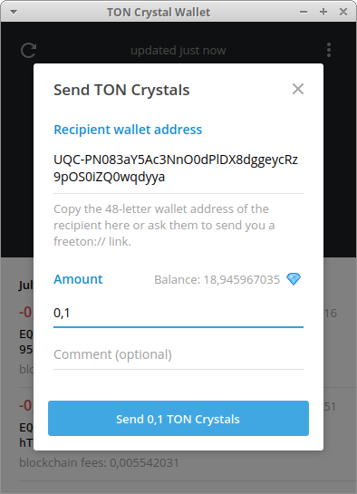

# Distributing TONs across multiple receivers

This repo contains smart contracts and Node JS scripts, which allows to execute massive TON distributions.

## Install

```
$ node --version
v10.21.0
$ npm install
```

## Contract description

The contract source is available at [/contracts/airdrop.sol](./contracts/airdrop.sol). To deploy contract you need to specify the following attributes:

- Refund address
- List of amounts
- List of receivers

**Important**: Attributes are specified at the creation step and can't be changed later.

### Refund address

This address will be used in case you need to return your TONs. The contract has the `refund(uint128 amount)` method which sends the specified amount to the refund address.


## Pipeline description

Bellow you can find the detailed description for each action, required for distribution process.

### 1. Create new key pair

This pair will be used for contract creation. The keys will be automatically written in the `keys.json` file.

```
$ node examples/generate-keys.js 

New keys written in the keys.json
{ public:
   '266c96f4a194cbacdb1329a37ddc285f237ad32d01ff1a9532d127e62123a53e',
  secret:
   'a2a2de9256ed927cbc639ece41a63b857a5f93ec16a31b439cb57060f44ff14a' }
```

Be careful: running the script again will rewrite the previous keys. Do this if you need to deploy another instance of the contract.

### 2. Specify the distribution details

For now, you need to edit the `examples/utils.js` file.

```
const REFUND_DESTINATION = '0:28861a9d4a9c9766e1129f7323e01ba0c98c33d5414c0036b8194282ff7abc5c';
const ADDRESSES = ["0:28861a9d4a9c9766e1129f7323e01ba0c98c33d5414c0036b8194282ff7abc5c"];
const AMOUNTS = [10];
```

### 3. Get the feature contract address

```
$ node examples/pre-deploy.js 
Future address of the contract will be: 0:be3cdd3cdda63901cdcd9ced1d3e50d7f1d8207b2711cfda4e4b4899434c2a77
Use this address for wallet: UQC-PN083aY5Ac3NnO0dPlDX8dggeycRz9pOS0iZQ0wqdyya
```

### 4. Send the TONs for contract deployment

Use any wallet (for example [Broxus wallet](https://l1.broxus.com/freeton/wallet)) to send TONs. The amount of TONs depends on the amount of provided pairs (receiver, amount). For 1 pair 0.1 TON is enough.



### 5. Deploy contract

After the TONs were received by the contract, you can deploy the contract.

```
$ node examples/deploy.js 
Contract deployed at 0:be3cdd3cdda63901cdcd9ced1d3e50d7f1d8207b2711cfda4e4b4899434c2a77
```

### 6. Verify the contract details

You can verify that the attributes are correct by calling the list of getter functions in contract. The script bellow just automates this process.

```
$ node examples/get-contract-details.js 0:be3cdd3cdda63901cdcd9ced1d3e50d7f1d8207b2711cfda4e4b4899434c2a77
Refund address:
0:50600a342eeae4c566e51447396b1871df3e9a16aab90009d85a16bf99408a69
List of receivers and amounts:
0:50600a342eeae4c566e51447396b1871df3e9a16aab90009d85a16bf99408a69 112233
```

### 7. Send the TONs to the contract

After you make sure that everything is correct, you should send the necessary amount of TONs to the contract. This also can be done with Broxus wallet.

### 8. Run the distribution

The important thing to now that each pair of (address, amount) will take part in distribution only once. So in any case, no address will receive the amount twice.

```
$ node examples/distribute.js 0:be3cdd3cdda63901cdcd9ced1d3e50d7f1d8207b2711cfda4e4b4899434c2a77
Called successfully
```

### 9. Run the refund

If you need to refund some TONs you can use the following script:


Edit the `examples/refund.js` to specify the amount:

```javascript
const msg = await contract.refund({
  amount: 1000, // here, nanograms
});
```


## Testing

The contract have been tested for

- Refund case
- Distribute case
- Double distribute case
- Distribute and refund case
